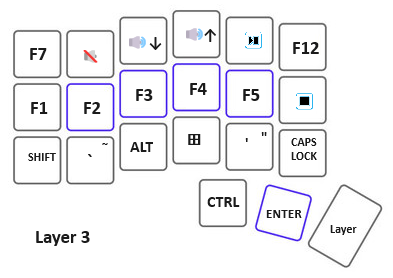
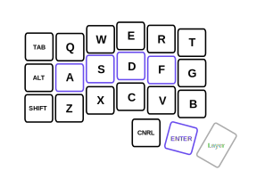

# CircuitPython Code for Corne like Keyboard

The design goals are for a DIY keyboard in a Corne like layout. 

1. Split keyboard with 3x6 column staggered keys and 3 thumb keys. 
    1. The idea here is to have home keys plus keys no more than one row or column away from the home position 
	   to avoid issues with reaching farther.
	2. Keep close to an open source design for the 3D printed case. The Corne layout has a track record. Adjustments are being made
	   so that a RPi Pico can be used. These boards are inexpensive, have lots of GPIO and can handle CircuitPython.
2. Keep it Simple. 
    1. The code does not need to be generalized for all keyboards (not using KMK). 
	2. The two halves are to have equal responsibility. Connect both halves to a USB hub. 
	   Each half to get a Pico board and they both already have on board microB USB connectors.
	3. Pico boards have more than enough GPIO to use one input per switch. There are 21 switches per side and each Pico has 26 
	   GPIO. Diodes are not needed because a matrix is not needed.
3. Keep cost down. 
    1. Use FDM 3D printer for parts that can be printed.
	2. Use point to point wiring - no PCB. This is more work but it avoids ordering custom parts and shipping costs.
4.  Using CircuitPython makes firmware changes easy. One just copies a text file to the Pico file system!
	

## Reference

* [Pico_RP2040_Mech_Keyboard/code.py](https://github.com/adafruit/Adafruit_Learning_System_Guides/blob/main/Pico_RP2040_Mech_Keyboard/code.py)
* [www.raspberrypi.com/.../pico-pinout.svg](https://www.raspberrypi.com/documentation/microcontrollers/images/pico-pinout.svg)
* [Adafruit code tutorial](https://learn.adafruit.com/diy-pico-mechanical-keyboard-with-fritzing-circuitpython/code-the-pico-keyboard)
* [Adafruit HID Library](https://docs.circuitpython.org/projects/hid/en/latest/)

## Implementation Progress

In this document I refer to layers 1, 2 and 3. In the current code the corresponding layers are numbered 0, 1 and 2. This departure occurred when the keymaps were altered 
to allow for media keys.

### Left Side

* The base layer 1 does the alphabetic characters.
* layer 2 does the numerals and much of the punctuation.
* layer 3 does Function keys, left over punctuation and cap-lock.

### Right Side

* The base layer 1 does the alphabetic characters.
* layer 2 does navigation.
* layer 3 numpad characters.

There is no direct connection between the left and right keyboards. Each half has a Layer key. When a layer key is pressed the active layer on 
that side is incremented by one.

On the left side the combination **left-shift + left-Layer** switches to layer1.
On the right side the combination **right-shift + right-Layer** switches to layer1.

  

  

  

media

### Left side keymap dictionary

There are two versions of the left side keymap.

* left-levels3.py contains twelve function keys on the third level. 
* left-media.py has media keys in place of some of the function keys.

Either file can be copied to code.py on the CIRCUITPY drive for the left keyboard to change to the other layout. Historically I was not using function keys 
above F5 but this has changed with some software I have been exploring recently.

#### From left-levels3.py

~~~~python
keymap = {
    (0): ((KEY, [Keycode.TAB]), (KEY, [Keycode.ESCAPE]), (KEY, [Keycode.F7])),
    # (1): ((KEY, [Keycode.Q]), (KEY, [Keycode.SIX]),
    #     (MEDIA, ConsumerControlCode.MUTE)),
    (1): ((KEY, [Keycode.Q]), (KEY, [Keycode.SIX]), (KEY, [Keycode.F8])),
    # (2): ((KEY, [Keycode.W]), (KEY, [Keycode.SEVEN]),
    #     (MEDIA, ConsumerControlCode.VOLUME_DECREMENT)),
    (2): ((KEY, [Keycode.W]), (KEY, [Keycode.SEVEN]), (KEY, [Keycode.F9])),
    # (3): ((KEY, [Keycode.E]), (KEY, [Keycode.EIGHT]),
    #     (MEDIA, ConsumerControlCode.VOLUME_INCREMENT)),
    (3): ((KEY, [Keycode.E]), (KEY, [Keycode.EIGHT]), (KEY, [Keycode.F10])),
    # (4): ((KEY, [Keycode.R]), (KEY, [Keycode.NINE]),
    #      (MEDIA, ConsumerControlCode.PLAY_PAUSE)),
    (4): ((KEY, [Keycode.R]), (KEY, [Keycode.NINE]), (KEY, [Keycode.F11])),
    (5): ((KEY, [Keycode.T]), (KEY, [Keycode.ZERO]), (KEY, [Keycode.F12])),

    (6): ((KEY, [Keycode.ALT]), (KEY, [Keycode.ALT]), (KEY, [Keycode.F1])),
    (7): ((KEY, [Keycode.A]), (KEY, [Keycode.ONE]), (KEY, [Keycode.F2])),
    (8): ((KEY, [Keycode.S]), (KEY, [Keycode.TWO]), (KEY, [Keycode.F3])),
    (9): ((KEY, [Keycode.D]), (KEY, [Keycode.THREE]), (KEY, [Keycode.F4])),
    (10): ((KEY, [Keycode.F]), (KEY, [Keycode.FOUR]), (KEY, [Keycode.F5])),
    # (11): ((KEY, [Keycode.G]), (KEY, [Keycode.FIVE]),
    #       (MEDIA, ConsumerControlCode.STOP)),
    (11): ((KEY, [Keycode.G]), (KEY, [Keycode.FIVE]), (KEY, [Keycode.F6])),

    (12): ((KEY, [Keycode.LEFT_SHIFT]),
           (KEY, [Keycode.LEFT_SHIFT]), (KEY, [Keycode.LEFT_SHIFT])),
    (13): ((KEY, [Keycode.Z]),
           (KEY, [Keycode.LEFT_BRACKET]), (KEY, [Keycode.GRAVE_ACCENT])),
    (14): ((KEY, [Keycode.X]), 
	       (KEY, [Keycode.RIGHT_BRACKET]), (MEDIA, ConsumerControlCode.MUTE)),
    (15): ((KEY, [Keycode.C]), (KEY, [Keycode.MINUS]), (KEY, [Keycode.WINDOWS])),
    (16): ((KEY, [Keycode.V]), (KEY, [Keycode.EQUALS]), (KEY, [Keycode.QUOTE])),
    (17): ((KEY, [Keycode.B]), (KEY, [Keycode.BACKSLASH]), (KEY, [Keycode.CAPS_LOCK])),

    (18): ((KEY, [Keycode.CONTROL]),
           (KEY, [Keycode.CONTROL]), (KEY, [Keycode.CONTROL])),
    (19): ((KEY, [Keycode.ENTER]), (KEY, [Keycode.ENTER]), (KEY, [Keycode.ENTER])),
    (20): ((OTHER, []), (OTHER, []), (OTHER, [])),

}
~~~~

#### From left-media.py

~~~~python
keymap = {
    (0): ((KEY, [Keycode.TAB]), (KEY, [Keycode.ESCAPE]), (KEY, [Keycode.F7])),
    (1): ((KEY, [Keycode.Q]), (KEY, [Keycode.SIX]), (MEDIA, ConsumerControlCode.MUTE)),
    # (1): ((KEY, [Keycode.Q]), (KEY, [Keycode.SIX]), (KEY, [Keycode.F8])),
    (2): ((KEY, [Keycode.W]), (KEY, [Keycode.SEVEN]),
          (MEDIA, ConsumerControlCode.VOLUME_DECREMENT)),
    # (2): ((KEY, [Keycode.W]), (KEY, [Keycode.SEVEN]), (KEY, [Keycode.F9])),
    (3): ((KEY, [Keycode.E]), (KEY, [Keycode.EIGHT]),
          (MEDIA, ConsumerControlCode.VOLUME_INCREMENT)),
    # (3): ((KEY, [Keycode.E]), (KEY, [Keycode.EIGHT]), (KEY, [Keycode.F10])),
    (4): ((KEY, [Keycode.R]), (KEY, [Keycode.NINE]),
          (MEDIA, ConsumerControlCode.PLAY_PAUSE)),
    # (4): ((KEY, [Keycode.R]), (KEY, [Keycode.NINE]), (KEY, [Keycode.F11])),
    (5): ((KEY, [Keycode.T]), (KEY, [Keycode.ZERO]), (KEY, [Keycode.F12])),

    (6): ((KEY, [Keycode.ALT]), (KEY, [Keycode.ALT]), (KEY, [Keycode.F1])),
    (7): ((KEY, [Keycode.A]), (KEY, [Keycode.ONE]), (KEY, [Keycode.F2])),
    (8): ((KEY, [Keycode.S]), (KEY, [Keycode.TWO]), (KEY, [Keycode.F3])),
    (9): ((KEY, [Keycode.D]), (KEY, [Keycode.THREE]), (KEY, [Keycode.F4])),
    (10): ((KEY, [Keycode.F]), (KEY, [Keycode.FOUR]), (KEY, [Keycode.F5])),
    (11): ((KEY, [Keycode.G]), (KEY, [Keycode.FIVE]),
           (MEDIA, ConsumerControlCode.STOP)),
    # (11): ((KEY, [Keycode.G]), (KEY, [Keycode.FIVE]), (KEY, [Keycode.F6])),

    (12): ((KEY, [Keycode.LEFT_SHIFT]),
           (KEY, [Keycode.LEFT_SHIFT]), (KEY, [Keycode.LEFT_SHIFT])),
    (13): ((KEY, [Keycode.Z]),
           (KEY, [Keycode.LEFT_BRACKET]), (KEY, [Keycode.GRAVE_ACCENT])),
    (14): ((KEY, [Keycode.X]), (KEY, [Keycode.RIGHT_BRACKET]), (KEY, [Keycode.ALT])),
    (15): ((KEY, [Keycode.C]), (KEY, [Keycode.MINUS]), (KEY, [Keycode.WINDOWS])),
    (16): ((KEY, [Keycode.V]), (KEY, [Keycode.EQUALS]), (KEY, [Keycode.QUOTE])),
    (17): ((KEY, [Keycode.B]), (KEY, [Keycode.BACKSLASH]), (KEY, [Keycode.CAPS_LOCK])),

    (18): ((KEY, [Keycode.CONTROL]),
           (KEY, [Keycode.CONTROL]), (KEY, [Keycode.CONTROL])),
    (19): ((KEY, [Keycode.ENTER]), (KEY, [Keycode.ENTER]), (KEY, [Keycode.ENTER])),
    (20): ((OTHER, []), (OTHER, []), (OTHER, [])),

}
~~~~

### Pin Assignment Left

~~~~python
# list of pins to use
pins = (
    board.GP0,
    board.GP1,
    board.GP2,
    board.GP3,
    board.GP4,
    board.GP5,
    board.GP6,
    board.GP7,
    board.GP8,
    board.GP9,
    board.GP10,
    board.GP11,
    board.GP12,
    board.GP13,
    board.GP14,
    board.GP15,
    board.GP16,
    board.GP17,
    board.GP18,
    board.GP19,
    board.GP20,
)
~~~~

### Right side keymap dictionary

#### From right-level.py

~~~~python 
keymap = {
    (0): ((KEY, [Keycode.BACKSPACE]), (KEY,  [Keycode.BACKSPACE]),
          (KEY,  [Keycode.BACKSPACE])),
    (1): ((KEY, [Keycode.P]), (KEY,  [Keycode.DELETE]), (KEY,  [Keycode.KEYPAD_MINUS])),
    (2): ((KEY, [Keycode.O]), (KEY,  [Keycode.PAGE_UP]), (KEY,  [Keycode.KEYPAD_NINE])),
    (3): ((KEY, [Keycode.I]), (KEY,  [Keycode.UP_ARROW]),
          (KEY,  [Keycode.KEYPAD_EIGHT])),
    (4): ((KEY, [Keycode.U]), (KEY,  [Keycode.HOME]), (KEY,  [Keycode.KEYPAD_SEVEN])),
    (5): ((KEY, [Keycode.Y]), (KEY,  [Keycode.PRINT_SCREEN]),
          (KEY,  [Keycode.KEYPAD_FORWARD_SLASH])),

    (6): ((KEY, [Keycode.ALT]), (KEY,  [Keycode.ALT]), (KEY,  [Keycode.RIGHT_ALT])),
    (7): ((KEY, [Keycode.SEMICOLON]), (KEY,  [Keycode.ENTER]),
          (KEY,  [Keycode.KEYPAD_PLUS])),
    (8): ((KEY, [Keycode.L]), (KEY,  [Keycode.RIGHT_ARROW]),
          (KEY,  [Keycode.KEYPAD_SIX])),
    (9): ((KEY, [Keycode.K]), (KEY,  [Keycode.DOWN_ARROW]),
          (KEY,  [Keycode.KEYPAD_FIVE])),
    (10): ((KEY, [Keycode.J]), (KEY,  [Keycode.LEFT_ARROW]),
           (KEY,  [Keycode.KEYPAD_FOUR])),
    (11): ((KEY, [Keycode.H]), (KEY,  [Keycode.SCROLL_LOCK]),
           (KEY,  [Keycode.KEYPAD_ASTERISK])),

    (12): ((KEY, [Keycode.RIGHT_SHIFT]), (KEY,  [Keycode.RIGHT_SHIFT]),
           (KEY,  [Keycode.RIGHT_SHIFT])),
    (13): ((KEY, [Keycode.FORWARD_SLASH]), (KEY,  [Keycode.APPLICATION]),
           (KEY,  [Keycode.KEYPAD_PERIOD])),
    (14): ((KEY, [Keycode.PERIOD]), (KEY,  [Keycode.PAGE_DOWN]),
           (KEY,  [Keycode.KEYPAD_THREE])),
    (15): ((KEY, [Keycode.COMMA]), (KEY,  [Keycode.TAB]), (KEY,  [Keycode.KEYPAD_TWO])),
    (16): ((KEY, [Keycode.M]), (KEY,  [Keycode.END]), (KEY,  [Keycode.KEYPAD_ONE])),
    (17): ((KEY, [Keycode.N]), (KEY,  [Keycode.PAUSE]), (KEY,  [Keycode.KEYPAD_ZERO])),

    (18): ((KEY, [Keycode.CONTROL]), (KEY,  [Keycode.CONTROL]),
           (KEY,  [Keycode.CONTROL])),
    (19): ((KEY, [Keycode.SPACEBAR]), (KEY,  [Keycode.SPACEBAR]),
           (KEY,  [Keycode.SPACEBAR])),
    (20): ((OTHER, []), (OTHER,  []), (OTHER,  [])),

}
~~~~

### Pin Assignment Right

~~~~python
# list of pins to use
pins = (
    board.GP28,
    board.GP27,
    board.GP26,
    board.GP22,
    board.GP21,
    board.GP20,
    board.GP19,
    board.GP18,
    board.GP17,
    board.GP16,
    board.GP6,
    board.GP5,
    board.GP12,
    board.GP11,
    board.GP10,
    board.GP9,
    board.GP8,
    board.GP7,
    board.GP15,
    board.GP14,
    board.GP13,
)
~~~~

## Hard Wiring the Keyboard

### Left Side (bottom view)

### Right side (bottom view)

# The 3D Printed Case

See https://github.com/danpeirce/scad-keyboard-cases?tab=readme-ov-file#corne-inspired-keyboard-case-modified-to-use-a-raspberry-pi-pico

## Experimenting with SVG file

I have created a SVG file  of the left side first layer. Testing to see how this looks on Github.

