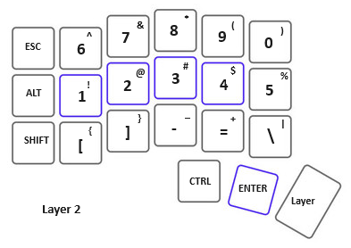

# CircuitPython Code for Corne like Keyboard

The design goals are for a DIY keyboard in a Corne like layout. 

1. Split keyboard with 3x6 column staggered keys and 3 thumb keys. 
    1. The idea here is to have home keys plus keys no more than one row or column away from the home position 
	   to avoid issues with reaching farther.
	2. Keep close to an open source design for the 3D printed case. The Corne layout has a track record. Adjustments are being made
	   so that a RPi Pico can be used. These boards are inexpensive, have lots of GPIO and can handle CircuitPython.
2. Keep it Simple. 
    1. The code does not need to be generalized for all keyboards (not using KMK). 
	2. The two halves are to have equal responsibility. Connect both halves to a USB hub. 
	   Each half to get a Pico board and they both already have on board microB USB connectors.
	3. Pico boards have more than enough GPIO to use one input per switch. There are 21 switches per side and each Pico has 26 
	   GPIO. Diodes are not needed because a matrix is not needed.
3. Keep cost down. 
    1. Use FDM 3D printer for parts that can be printed.
	2. Use point to point wiring - no PCB. This is more work but it avoids ordering custom parts and shipping costs.
4.  Using CircuitPython makes firmware changes easy. One just copies a text file to the Pico file system!
	

## Reference

* [Pico_RP2040_Mech_Keyboard/code.py](https://github.com/adafruit/Adafruit_Learning_System_Guides/blob/main/Pico_RP2040_Mech_Keyboard/code.py)
* [www.raspberrypi.com/.../pico-pinout.svg](https://www.raspberrypi.com/documentation/microcontrollers/images/pico-pinout.svg)
* [Adafruit HID Library](https://docs.circuitpython.org/projects/hid/en/latest/)

## Implementation Progress

So far I have built the left side only and implemented three layers for the left hand keyboard. 
Currently I am using a standard US Keyboard for the right hand.

* The base layer 1 does the alphabetic characters.
* layer 2 does the numerals and much of the punctuation.
* layer 3 has some Function keys, left over punctuation, backspace and delete
    * Will likely make changes to Layer 3 after right side keyboard is built. *

Currently I am using the left-side pico-corne with my left hand and a regular keyboard with my right hand. This gives me the split I am looking
for and allows me to reach all the numbers and a lot of the punctuation with my left hand all near the home row.

There is no direct connection between the left and right keyboards but this has not been an issue. Only the left custom keyboard has layers.
The layers are controlled with switch 20 which is the right most thumb key. Each press of this key increments the layer by one. Currently if 
the layer number is greater than 3 then the layer is set back to one. The board LED now indicates layer one. The third thumb key increments the layer
on the same side of the split keyboard.

Work is just starting on the right side firmware. Each side runs its own program which differs in the keymap dictionary. 

  

  

  

### Left side keymap dictionary

*I'm planing to make substantial changes to the left third layer after the right side is completed.*

~~~~python
keymap = {
    (0): (KEY, [Keycode.TAB], [Keycode.ESCAPE], [Keycode.ESCAPE]),
    (1): (KEY, [Keycode.Q], [Keycode.SIX], [Keycode.F1]),
    (2): (KEY, [Keycode.W], [Keycode.SEVEN], [Keycode.F2]),
    (3): (KEY, [Keycode.E], [Keycode.EIGHT], [Keycode.F3]),
    (4): (KEY, [Keycode.R], [Keycode.NINE], [Keycode.F4]),
    (5): (KEY, [Keycode.T], [Keycode.ZERO], [Keycode.F5]),

    (6): (KEY, [Keycode.ALT], [Keycode.ALT], [Keycode.F6]),
    (7): (KEY, [Keycode.A], [Keycode.ONE], [Keycode.F7]),
    (8): (KEY, [Keycode.S], [Keycode.TWO], [Keycode.F8]),
    (9): (KEY, [Keycode.D], [Keycode.THREE], [Keycode.F12]), 
    (10): (KEY, [Keycode.F], [Keycode.FOUR], [Keycode.SEMICOLON]),
    (11): (KEY, [Keycode.G], [Keycode.FIVE], [Keycode.QUOTE]),

    (12): (KEY, [Keycode.LEFT_SHIFT], [Keycode.LEFT_SHIFT], [Keycode.LEFT_SHIFT]),
    (13): (KEY, [Keycode.Z], [Keycode.LEFT_BRACKET], [Keycode.GRAVE_ACCENT]), 
    (14): (KEY, [Keycode.X], [Keycode.RIGHT_BRACKET], [Keycode.COMMA]),
    (15): (KEY, [Keycode.C], [Keycode.MINUS], [Keycode.PERIOD]),
    (16): (KEY, [Keycode.V], [Keycode.EQUALS], [Keycode.FORWARD_SLASH]),
    (17): (KEY, [Keycode.B], [Keycode.BACKSLASH], [Keycode.CAPS_LOCK]),

    (18): (KEY, [Keycode.CONTROL], [Keycode.CONTROL], [Keycode.BACKSPACE]),
    (19): (KEY, [Keycode.ENTER], [Keycode.ENTER], [Keycode.DELETE]),
    (20): (OTHER, [], [], []),

}
~~~~

### Pin Assignment Left

~~~~python
# list of pins to use
pins = (
    board.GP0,
    board.GP1,
    board.GP2,
    board.GP3,
    board.GP4,
    board.GP5,
    board.GP6,
    board.GP7,
    board.GP8,
    board.GP9,
    board.GP10,
    board.GP11,
    board.GP12,
    board.GP13,
    board.GP14,
    board.GP15,
    board.GP16,
    board.GP17,
    board.GP18,
    board.GP19,
    board.GP20,
)
~~~~

### Right side keymap dictionary

*work in progress*

~~~~python
keymap = {
    (0): (KEY, [Keycode.BACKSPACE], [Keycode.BACKSPACE], [Keycode.BACKSPACE]),
    (1): (KEY, [Keycode.P], [Keycode.DELETE], [Keycode.KEYPAD_MINUS]),
    (2): (KEY, [Keycode.O], [Keycode.PAGE_UP], [Keycode.KEYPAD_NINE]),
    (3): (KEY, [Keycode.I], [Keycode.UP_ARROW], [Keycode.KEYPAD_EIGHT]),
    (4): (KEY, [Keycode.U], [Keycode.HOME], [Keycode.KEYPAD_SEVEN]),
    (5): (KEY, [Keycode.Y], [Keycode.PRINT_SCREEN], [Keycode.KEYPAD_FORWARD_SLASH]),

    (6): (KEY, [Keycode.ALT], [Keycode.ALT], [Keycode.RIGHT_ALT]),
    (7): (KEY, [Keycode.SEMICOLON], [Keycode.ENTER], [Keycode.KEYPAD_PLUS]),
    (8): (KEY, [Keycode.L], [Keycode.RIGHT_ARROW], [Keycode.KEYPAD_SIX]),
    (9): (KEY, [Keycode.K], [Keycode.DOWN_ARROW], [Keycode.KEYPAD_FIVE]),
    (10): (KEY, [Keycode.J], [Keycode.LEFT_ARROW], [Keycode.KEYPAD_FOUR]),
    (11): (KEY, [Keycode.H], [Keycode.SCROLL_LOCK], [Keycode.KEYPAD_ASTERISK]),

    (12): (KEY, [Keycode.RIGHT_SHIFT], [Keycode.RIGHT_SHIFT], [Keycode.RIGHT_SHIFT]),
    (13): (KEY, [Keycode.FORWARD_SLASH], [Keycode.APPLICATION], [Keycode.KEYPAD_PERIOD]),
    (14): (KEY, [Keycode.PERIOD], [Keycode.PAGE_DOWN], [Keycode.KEYPAD_THREE]),
    (15): (KEY, [Keycode.COMMA], [Keycode.TAB], [Keycode.KEYPAD_TWO]),
    (16): (KEY, [Keycode.M], [Keycode.END], [Keycode.KEYPAD_ONE]),
    (17): (KEY, [Keycode.N], [Keycode.PAUSE], [Keycode.KEYPAD_ZERO]),

    (18): (KEY, [Keycode.CONTROL], [Keycode.CONTROL], [Keycode.CONTROL]),
    (19): (KEY, [Keycode.SPACEBAR], [Keycode.SPACEBAR], [Keycode.SPACEBAR]),
    (20): (OTHER, [], [], []),

}
~~~~

### Pin Assignment Right

~~~~python
# list of pins to use
pins = (
    board.GP28,
    board.GP27,
    board.GP26,
    board.GP22,
    board.GP21,
    board.GP20,
    board.GP19,
    board.GP18,
    board.GP17,
    board.GP16,
    board.GP6,
    board.GP5,
    board.GP12,
    board.GP11,
    board.GP10,
    board.GP9,
    board.GP8,
    board.GP7,
    board.GP15,
    board.GP14,
    board.GP13,
)
~~~~

## Hard Wiring the Keyboard

### Left Side (bottom view)

### Right side (bottom view)

# The 3D Printed Case

See https://github.com/danpeirce/scad-keyboard-cases?tab=readme-ov-file#corne-inspired-keyboard-case-modified-to-use-a-raspberry-pi-pico
